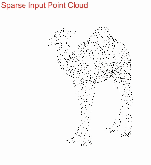

# PU-Ray
 [arXiv](https://arxiv.org/abs/2310.08755) | [Code](https://github.com/sum1lim/PU-Ray)

Official implementation of "PU-Ray: Point Cloud Upsampling via Ray Marching on Implicit Surface".



## Installation
### Create virtual environment and install dependencies
```
conda create -n pu-ray python==3.8.17
conda activate pu-ray
pip install -r requirements.txt
pip install .
```
To check the installation:
```
pip freeze | grep pu-ray
```

## Datasets
[PU1K](https://drive.google.com/drive/folders/1k1AR_oklkupP8Ssw6gOrIve0CmXJaSH3) point clouds and [PU-GAN](https://drive.google.com/open?id=1BNqjidBVWP0_MUdMTeGy1wZiR6fqyGmC) mesh files are used for training and evaluation. Follow [Grad-PU](https://github.com/yunhe20/Grad-PU#data-preparation) for data preparation.

## Traning
To train with the prepared data, simply run the following command. 
```
bash train.sh
```
Modify the arguments to experiment with different configurations. The command information can be found using the following command.
```
train_model -h
usage: train_model [-h] [--input-dir INPUT_DIR] [--query-dir QUERY_DIR] [--log LOG] [--patch-k PATCH_K] [--marching-steps MARCHING_STEPS] [--num-sample NUM_SAMPLE]
                   [--num-query NUM_QUERY] [--num-op NUM_OP] [--verbose] [--seed SEED] [--num-epochs NUM_EPOCHS]

optional arguments:
  -h, --help            show this help message and exit
  --input-dir INPUT_DIR
                        Train data directory
  --query-dir QUERY_DIR
                        Query data directory
  --log LOG             log file name
  --patch-k PATCH_K     Patch size
  --marching-steps MARCHING_STEPS
                        Marching steps
  --num-sample NUM_SAMPLE
                        Number of training point clouds samples
  --num-query NUM_QUERY
                        Number of training query rays
  --num-op NUM_OP       Number of observation points
  --verbose             Print to stdout
  --seed SEED           Random seed
  --num-epochs NUM_EPOCHS
                        Number of epochs

usage: test_model [-h] [--input-dir INPUT_DIR] [--query-dir QUERY_DIR] [--model MODEL] [--patch-k PATCH_K] [--marching-steps MARCHING_STEPS] [--num-query NUM_QUERY]
                  [--num-op NUM_OP] [--verbose]

optional arguments:
  -h, --help            show this help message and exit
  --input-dir INPUT_DIR
                        Train data directory
  --query-dir QUERY_DIR
                        Query data directory
  --model MODEL         Model name
  --patch-k PATCH_K     Patch size
  --marching-steps MARCHING_STEPS
                        Marching steps
  --num-query NUM_QUERY
                        Number of testing samples
  --num-op NUM_OP       Number of observation points
  --verbose             Print to stdout
```

## Upsampling
[Pre-trained models](https://github.com/sum1lim/PU-Ray/tree/main/models) are provided. Run the following command to upsample the prepared point clouds.
```
bash upsample.sh
```
Modify the arguments to upsample with different configurations. The command information can be found using the following command.
```
pu_ray -h
usage: pu_ray [-h] [--input INPUT] [--gt-dir GT_DIR] [--output-dir OUTPUT_DIR] [--gt-queries] [--model MODEL] [--patch-k PATCH_K] [--query-k QUERY_K] [--r R]
              [--marching-steps MARCHING_STEPS] [--implicit-points] [--num-op NUM_OP] [--real-scanned]

optional arguments:
  -h, --help            show this help message and exit
  --input INPUT         Input point cloud file name
  --gt-dir GT_DIR       Ground truth point cloud directory
  --output-dir OUTPUT_DIR
                        Name of the output file
  --gt-queries          Sample queries from ground truth
  --model MODEL         Model name
  --patch-k PATCH_K     Patch size
  --query-k QUERY_K     Neighbourhood size for novel query sampling
  --r R                 Upsampling rate
  --marching-steps MARCHING_STEPS
                        Marching steps
  --implicit-points     Output implicit points
  --num-op NUM_OP       Number of observation points
  --real-scanned        Real scanned data adaptation
```

## Evaluation
Follow [PU-GCN](https://github.com/guochengqian/PU-GCN/tree/master/evaluation_code) for evaluation of Chamfer Distance (CD), Hausdorff Distance (HD) and Point-to-Surface Distance (P2F).

## References
```
@InProceedings{Qian_2021_CVPR,
    author    = {Qian, Guocheng and Abualshour, Abdulellah and Li, Guohao and Thabet, Ali and Ghanem, Bernard},
    title     = {PU-GCN: Point Cloud Upsampling Using Graph Convolutional Networks},
    booktitle = {Proceedings of the IEEE/CVF Conference on Computer Vision and Pattern Recognition (CVPR)},
    month     = {June},
    year      = {2021},
    pages     = {11683-11692}
}

@inproceedings{li2019pugan,
     title={PU-GAN: a Point Cloud Upsampling Adversarial Network},
     author={Li, Ruihui and Li, Xianzhi and Fu, Chi-Wing and Cohen-Or, Daniel and Heng, Pheng-Ann},
     booktitle = {{IEEE} International Conference on Computer Vision ({ICCV})},
     year = {2019}
 }

@InProceedings{He_2023_CVPR,
    author    = {He, Yun and Tang, Danhang and Zhang, Yinda and Xue, Xiangyang and Fu, Yanwei},
    title     = {Grad-PU: Arbitrary-Scale Point Cloud Upsampling via Gradient Descent with Learned Distance Functions},
    booktitle = {Proceedings of the IEEE/CVF Conference on Computer Vision and Pattern Recognition (CVPR)},
    year      = {2023}
}
```
## Citation
```
@misc{lim2023puray,
      title={PU-Ray: Point Cloud Upsampling via Ray Marching on Implicit Surface}, 
      author={Sangwon Lim and Karim El-Basyouny and Yee Hong Yang},
      year={2023},
      eprint={2310.08755},
      archivePrefix={arXiv},
      primaryClass={cs.CV}
}
```
